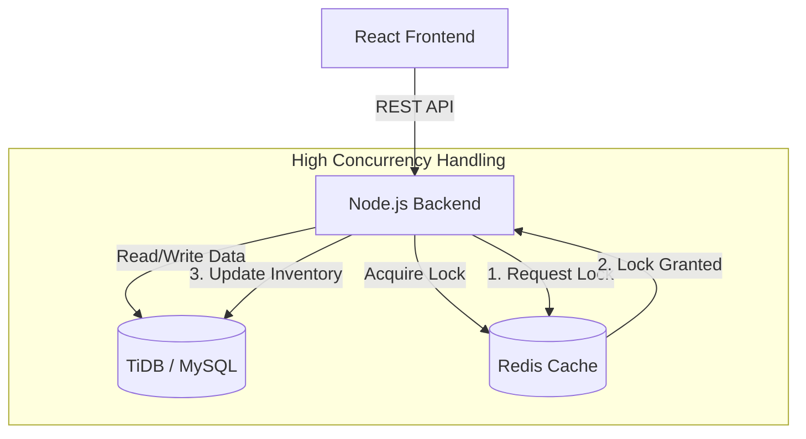

# ✈️ AirSync Flight Booking Engine

[](https://air-sync-v1.vercel.app)
[](https://dashboard.render.com/)

**AirSync** is a full-stack flight booking application engineered to handle real-world backend challenges. Unlike typical booking CRUD apps, AirSync focuses on maintaining data consistency under high concurrency and optimizing search performance for large datasets.

The primary goal was to architect a system capable of preventing race conditions during simultaneous bookings and delivering instant search results regardless of database size.

---

## 🏗️ System Architecture



*> Note: The architecture separates concerns between a responsive React frontend and a robust Node.js backend layer. The critical booking logic relies on Redis as a high-speed locking mechanism before putting permanent data into a distributed MySQL database (TiDB).*

---

## ⚡ Key Engineering Highlights

This project was built to solve specific technical bottlenecks common in large-scale booking systems.

### 1. Handling High Concurrency with Distributed Locking (Redis)
**The Problem:** In a real-world scenario, two users might click "Book" on the last available seat at the exact same millisecond. Without intervention, both requests could pass the initial database check, leading to a double-booking disaster.

**The Solution:** Implemented a distributed locking mechanism using **Redis**.
* Before any booking transaction begins, the system attempts to acquire a unique lock key (e.g., `LOCK:FLIGHT:101:SEAT:1A`) with a short TTL.
* Redis's atomic nature ensures only one request secures the lock.
* Subsequent requests are immediately rejected with a "Seat locked" status, ensuring strong consistency.

### 2. Optimizing Range Queries with Segment Trees
**The Problem:** Users frequently filter flights by price range (e.g., "Show lowest price between today and next month"). On a large dataset, running standard SQL aggregation queries repeatedly is slow (O(N) complexity).

**The Solution:** Engineered a **Segment Tree** data structure in memory on the backend.
* Flight price data is pre-loaded into the Segment Tree on server start.
* Range minimum queries are reduced from **O(N) to O(log N)** time complexity.
* This allows the "Cheapest Flight Found" feature to load instantly, even as the database grows.

### 3. Scalable Relational Database Design (TiDB)
The database schema is designed in **3NF** to handle complex relationships between `Flights`, `Airports`, `Cities`, and `Bookings`. The system utilizes **TiDB Cloud**, a distributed SQL database, ensuring the storage layer is ready for horizontal scalability without sacrificing ACID compliance.

---

## 🛠️ Tech Stack

| Category | Technologies |
| :--- | :--- |
| **Frontend** | React.js, Tailwind CSS, Axios |
| **Backend** | Node.js, Express.js |
| **Database** | MySQL (TiDB Cloud), Redis (Upstash) |
| **ORM** | Sequelize |
| **DevOps** | Vercel (FE Hosting), Render (BE Hosting) |

---

## 🚀 Local Setup & Installation

To run the system locally, you need Node.js installed and connection strings for MySQL and Redis.

### 1. Clone the Repository
```bash
git clone [https://github.com/mehtahrdk/AirSync.git](https://github.com/mehtahrdk/AirSync.git)
cd AirSync
